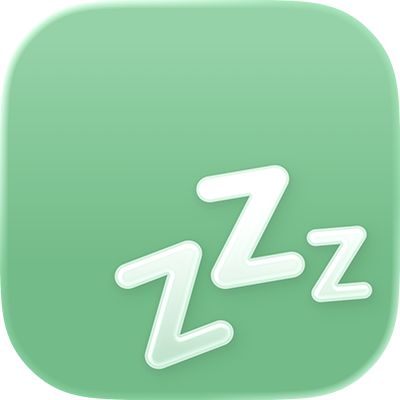

<h4 align="right">English | <strong><a href="README_CN.md">中文</a></strong></h4>

<div align="center">
  
  <h1>Off Day</h1>
  <p><strong>No alarms on off days.</strong></p>
  <p>A holiday-aware iOS app for day classification, automation, and reminders.</p>
</div>

<p align="center">
  <a href="https://swift.org/"></a>
  <a href="https://developer.apple.com/ios/"></a>
  <a href="https://apps.apple.com/app/id6501973975"></a>
  <a href="LICENSE"></a>
</p>

## Overview

Off Day helps users decide whether a day should be treated as an off day or a work day, then use that result in iOS Shortcuts and notification workflows.

The app is local-first:
- Holiday data is bundled as JSON templates or user-imported custom plans.
- User overrides, comments, and settings are stored in a local SQLite database.
- Optional iCloud backup is available for database snapshots.

## Key Features

- Multi-layer day decision engine with deterministic priority:
  `User Mark > Public Holiday Template > Base Calendar`
- Built-in public holiday templates:
  China Mainland, Xinjiang, Tibet, Guangxi, Ningxia, Hong Kong, Macau (Public / Force / Civil Servant), Singapore, Thailand, Korea, Japan, United States
- Custom public holiday plans:
  create, edit, duplicate, import JSON, export JSON
- Flexible base calendar modes:
  Standard weekly, Week-cycle, Day-cycle
- Rich App Intents for Shortcuts automation:
  check day type, check clash day, get day details, find next off/work day, update day mark, manage day comments
- Notification center for three scenarios:
  template expiration, upcoming public holidays, upcoming custom-mark days
- Backup and restore:
  iCloud auto backup, manual database export/import (`.zip` / `.sqlite`)
- Localization support:
  English, Simplified Chinese, Traditional Chinese, Traditional Chinese (Hong Kong)
- Optional alternative calendar display:
  Chinese lunar / Kyureki data support

## How Off Day Decides a Day Type

Off Day merges three data sources in fixed order:

1. User mark (manual override)
2. Public holiday template entry (including holiday shifts)
3. Base calendar configuration

Equivalent logic:

```text
finalDayType = userMark ?? publicHolidayType ?? baseCalendarType
```

This rule is implemented in `Off Day/DayManager.swift`.

## Built-in Holiday Template Coverage

Template files are located at `Off Day/PublicPlan/JSON/`.

| Region | Coverage |
| --- | --- |
| China Mainland / Xinjiang / Tibet / Guangxi / Ningxia | 2024-01-01 to 2026-12-31 |
| Hong Kong | 2024-01-01 to 2026-12-31 |
| Macau (Public / Force / Civil Servant) | 2024-01-01 to 2026-12-31 |
| Singapore | 2024-01-01 to 2026-12-31 |
| Thailand | 2024-01-01 to 2026-12-31 |
| Korea | 2024-01-01 to 2026-12-31 |
| United States (Federal) | 2024-01-01 to 2026-12-31 |
| Japan | 1955-01-01 to 2026-12-31 |

## Quick Start (User)

1. Select a public holiday template.
2. Configure your base calendar mode.
3. Add Off Day intents in Shortcuts.
4. Build personal automations (alarm, focus mode, reminders).
5. Optionally add manual day marks and comments for exceptions.

## Development

### Requirements

- macOS with Xcode 14 or newer
- iOS/iPadOS 16.0+
- Swift Package Manager (resolved automatically by Xcode)

### Run

```bash
git clone https://github.com/zizicici/Off-Day.git
cd Off-Day
open "Off Day.xcodeproj"
```

Select the `Off Day` scheme and run on simulator or device.

### Dependencies

- [GRDB.swift](https://github.com/groue/GRDB.swift) `7.9.0`
- [SnapKit](https://github.com/SnapKit/SnapKit) `5.7.1`
- [Toast-Swift](https://github.com/scalessec/Toast-Swift) `5.1.1`
- [MarqueeLabel](https://github.com/cbpowell/MarqueeLabel) `4.5.3`
- [ZipArchive](https://github.com/ZipArchive/ZipArchive) `2.6.0`
- [ZCCalendar](https://github.com/zizicici/ZCCalendar) `0.1.4`
- [AppInfo](https://github.com/zizicici/AppInfo) `1.3.0`

## Project Structure

```text
Off Day/
├── Block/           # Main calendar UI and day interaction
├── PublicPlan/      # Built-in and custom holiday plans
├── BaseCalendar/    # Base calendar strategies
├── Intent/          # App Intents for Shortcuts
├── Notification/    # Local notification scheduling
├── Backup/          # iCloud backup and DB import/export
├── Database/        # GRDB models, migrations, persistence
├── ChineseCalendar/ # Lunar/Kyureki data support
└── More/            # Settings, about, tutorials, support
```

## JSON Format for Custom Holiday Plan

Imported/exported plans follow this shape:

```json
{
  "name": "My Plan",
  "start": "2026-01-01",
  "end": "2026-12-31",
  "days": [
    {
      "name": "New Year",
      "date": "2026-01-01",
      "type": "offDay"
    }
  ]
}
```

Reference model: `Off Day/PublicPlan/Model/JSONPublicPlan.swift`.

## Roadmap

- [x] Built-in multi-region holiday templates
- [x] Custom template import/export
- [x] Base calendar modes (standard/week-cycle/day-cycle)
- [x] App Intents + automation workflow
- [x] Backup and restore
- [ ] Interactive widget
- [ ] Subscribable remote holiday templates

## Contributing

Issues and pull requests are welcome.

If you contribute holiday data:
- Keep `start`/`end` aligned with actual dataset coverage.
- Ensure all `days[].date` values stay within the range.
- Keep JSON sorted and readable.

## Screenshots

<div align="center">
  
</div>

## License

Off Day is available under the [MIT License](LICENSE).
